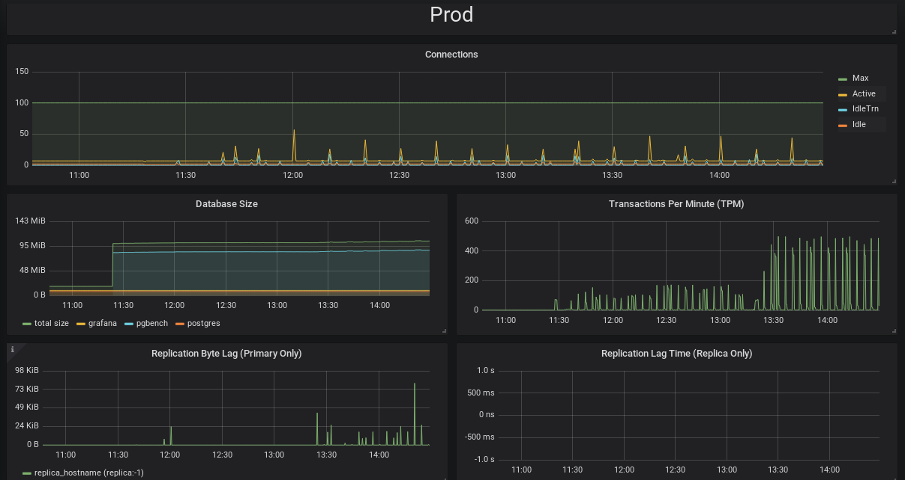

# pgMonitor

### [pgMonitor](https://github.com/CrunchyData/pgMonitor) is your all-in-one tool to easily create an environment to visualize the health and performance of your [PostgreSQL](http://www.postgresql.org/) cluster.

pgMonitor combines a suite of tools to facilitate the collection and visualization of important metrics that you need be aware of in your PostgreSQL database and your host environment, including:

- Connection counts: how busy is your system being accessed and if connections are hanging
- Database size: how much disk your cluster is using
- Replication lag: know if your replicas are falling behind in loading data from your primary
- Transaction wraparound: don't let your PostgreSQL database stop working
- Bloat: how much extra space are your tables and indexes using
- System metrics: CPU, Memory, I/O, uptime

pgMonitor is also highly configurable, and advanced users can design their own metrics, visualizations, and add in other features such as alerting.

Running pgMonitor will give you confidence in understanding how well your PostgreSQL cluster is performing, and will provide you the information to make calculated adjustments to your environment.

---

Please view the official Crunchy Data pgMonitor documentation
[here](https://access.crunchydata.com/documentation/pgmonitor/2.4/). If you
are interested in contributing or making an update to the documentation,
please view the
[Contributing Guidelines](https://access.crunchydata.com/documentation/pgmonitor/2.4/contributing/).

---

## Sponsors

[Crunchy Data](https://www.crunchydata.com/) is pleased to sponsor pgMonitor and many other [open-source projects](https://github.com/CrunchyData/) to help promote support the PostgreSQL community and software ecosystem.

---

## Legal Notices

Copyright © 2019 Crunchy Data Solutions, Inc.

CRUNCHY DATA SOLUTIONS, INC. PROVIDES THIS GUIDE "AS IS" WITHOUT WARRANTY OF ANY KIND, EITHER EXPRESS OR IMPLIED, INCLUDING, BUT NOT LIMITED TO, THE IMPLIED WARRANTIES OF NON INFRINGEMENT, MERCHANTABILITY OR FITNESS FOR A PARTICULAR PURPOSE.

Crunchy, Crunchy Data Solutions, Inc. and the Crunchy Hippo Logo are trademarks of Crunchy Data Solutions, Inc.
