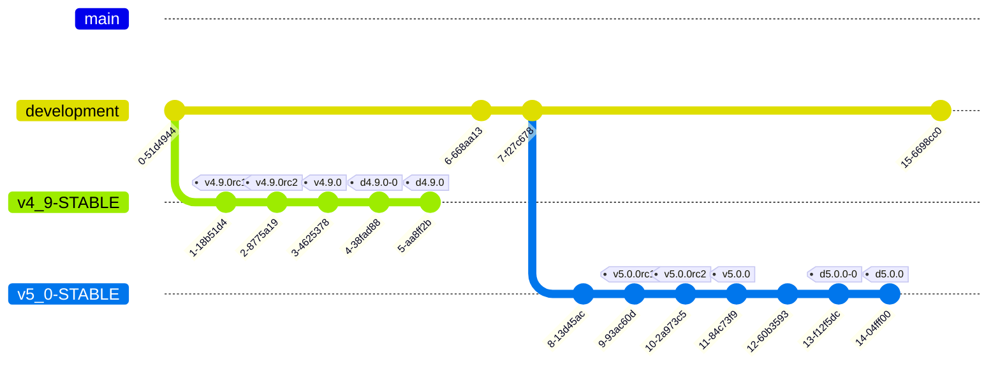

# Internal Notes

This document serves to outline internal processes and steps for managing the releases of this product

## Release cycle steps/internal checklist

By convention, `upstream` here is just the main `CrunchyData` repo, compared to your local fork. `upstream/main` is a historical artifact and will likely go away at some point.

Starting from the previous release being tagged and released to the access portal, this is the general development process that will be followed:

1. New development cycle: `upstream/development` is used as the integration branch for all PRs, and is the PR target.
2. Review outstanding issues for development on the next milestone.
   - We triage all open issues that are either 'unconfirmed' or not assigned a release. Accepted issues get assigned to 'future release' (this is a commitment that yes we think it's worth addressing but we're not yet committing to a schedule)
   - Rename "Next" to "[This Release]" (new version name) to catch previously-assigned issues for this release
   - Create new "Next" milestone
   - Review existing "Future" issues and assign to "This Release" as approved
   - During development, if issues NNN is bigger than we thought, or there isn't enough time then can move from "[This Release]" to "Next" (basically backlog which should take priority for the next release cycle)
3. Determine the next release version number, i.e. whether this will be a major or minor release based on semantic versioning policies. Note this can change if a suddenly larger issue becomes priority or gets put off until later. But that should be discouraged and the focus for the next release should be determined up front.
4. Any holdover PRs with major changes from the previous release (for instance major refactors or pieces which cover the majority of the role which need maximal testing coverage during development) should be merged in.  These should be marked with a "READY TO MERGE" tag so we can track.
5. Feature development process:
   - discussion about the feature if required
   - code and docs together in the same PR
   - ensure appropriate testing has been done based on areas of the code being tested (see the PR template for high-level)
   - merge into `upstream/development`
6. Determine lock package requirements for the release per version
   - can be specified based on OS-specific availability and requirements
   - update the Google Doc with the crunchylock requirements for build team
7. Feature Freeze - no new functionality, only bug fixes
8. Prepare and tag RC1. This should involve the following steps before the tag:
   - update copyright dates
   - recheck for deprecated variables
   - tag and sign the release
9. Get build team to build RC versions of crunchylock packages and HA packages for testing
    - pgMonitor development can now be tested along side HA against ansible host using local packages for roles
10. Validation of product
    - automated testing of common scenarios and potential matrix validation for all supported OS and deployments
    - ideally test session to cover all service functionality (exporter/prometheus/grafana) in at least a minimal form
    - since the packages themselves are being validated for all OS/Pg combinations, we cannot skip testing like we can in development, we need full matrix here
    - upgrade policy with true semver:
      - one major version upgrade from previous
      - minor versions should be backwards-compatible, so could upgrade from any earlier release with the same major version to the latest without user-visible changes
      - by extension, a major upgrade should work from any minor version the previous major release to the latest minor version of the current major release
11. Iterative identification of bugs in current releases (a missing feature is not considered a bug in this case, and should be considered for step 5 in the next release cycle -- see "next release" milestone)
12. As needed, prepare additional RC candidates until everything passes for final release
13. While primary docs work should be integrated with regular development process (see step 5) there may be additional changes, so verify before final release.
14. Create new branch based on current `upstream/development` for the release itself.  This should be named `v4_9-STABLE` (adjusting for appropriate version number not including patch number). All bug fixes and doc changes resulting from RC testing for this pgMonitor version should be made against this branch, with additional PRs with the cherry-picked commits applied to `upstream/development` for the next version if required.
15. Final code release/tagging
    - Ensure a version release summary changelog fragment has been created once all RC testing is complete.
    - run `antsibull-changelog release --version N.N.N --date YYYY-MM-DD` to generate the Changelog
    - tag main release on the appropriate release branch `v#_#-STABLE`, using semantic versioning (example: `v4.9.0`)
    - docs ideally are done at this phase; if so, tag `d#.#.#-0` for the initial docs release. (subsequent releases will increase this release number; see the "Making changes to back branches" section below.)
    - also need to tag the "moving" docs tag, so the `d#.#.#` in this case
    - code changes must have subsequent bugfix releases and code tags should be immutable; no rc candidates for patch releases, so tags will be: `v4.9.0rc1`, `v4.9.0rc2`, etc, then `v4.9.0` for initial release, `v4.9.1`, etc for subsequent ones. (See the "Making changes to back branches" section below for more details.)
    - Merge the new version branch back to Main branch to keep initial public facing code on Github at the current release
    - the doc tag should be reset if there are any changes to the released docs there

16. Build team builds final code and lock package versions
17. Preprod testing/validation
18. Prod rollout to access portal
19. Documentation release to access portal via the doc tag for this release.  If needed, additional documentation tweaks can be done against the `v4_9-STABLE` branch and the doc tag can be moved (though see "Making changes to back branches", step 6 for guidance).
20. Release notes and release blog article/customer promotion.
21. Announce release to various channels: #releases on Slack, marketing email, blog, company-wide email, etc.

## Making changes to back branches

A "back branch" is considered any branch which belongs to an already-released version of pgMonitor, so effectively anything which is not currently in development.  Note: at this time back branches are currently only supported for pgMonitor 4.8 and later.

If a bug fix in the code or documentation for a given release is required, you should follow the following procedures:

1. Checkout a new branch based on the appropriate upstream branch.  For instance if you were patching pgMonitor release 4.9.0, you would use `upstream/v4.9-STABLE` as the base.
2. Make your local changes and test appropriately.  Depending on which version you are adjusting there may or may not be automated testing support.
3. Create a new PR with the base of the target branch. Go through the normal PR review/acceptance process.  Merge the PR into the appropriate upstream branch.
4. Checkout the upstream primary branch.
5. If the changes require new packages to be built you will need to tag a new release:
   - for 4.8.0 and higher you will need to tag a new patch release with semantic versioning; i.e.: `v4.9.1`
6. If the changes involve any documentation updates, you will need to:
   a. tag a new specific doc release revision; i.e., `d4.9.0-N`. This corresponds to an immutable "docs have been released" version and allows us to track.
   b. ensure that the docs changes are what are expected; `git diff d4.9.0-2 d4.9.0-3 -- hugo` (using the appropriate current release and previous release).  If you notice something wrong at this point and you have not pushed this tag you can correct locally and re-tag with the same release version.  If this tag has already been pushed, correct and increment the docs release number, repeating step 5.
   c. push the new tag to upstream via `git push upstream d4.9.0-N` (substitute appropriate upstream remote name and tag here).
7. Inform the build team of the availability of the new code and/or doc tags.
